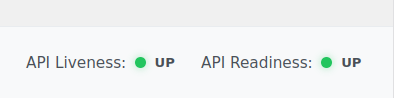
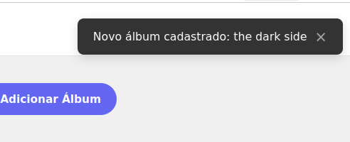

# Desafio SEPLAG 2026 - Sistema de Gestão Musical

Este projeto é uma solução completa (Full Stack) para o Desafio SEPLAG 2026, consistindo em uma plataforma para o gerenciamento de artistas e seus respectivos álbuns.

## 📝 Detalhes da Inscrição
- **Candidato:** André Parada de Oliveira Machado
- **Projeto:** PROJETO PRÁTICO - IMPLEMENTAÇÃO FULL STACK SÊNIOR - JAVA + ANGULAR
- **Vaga:** Engenheiro da Computação - Sênior
- **Inscrição:** 16418

---

## 🚀 Tecnologias Utilizadas

### **Back End**
- **Java 21** & **Spring Boot 3.4**
- **Spring Security** com autenticação **JWT** (Access & Refresh Tokens)
- **Spring Data JPA** com PostgreSQL
- **Flyway** (Gerenciamento de Migrations)
- **MinIO** (Armazenamento de arquivos compatível com S3)
- **Bucket4j** (Implementação de Rate Limit por API/Usuário)
- **Spring WebSocket** (Notificações em tempo real via STOMP)
- **JUnit 5** & **Mockito** (Testes Unitários)

### **Front End**
- **Angular 21** (Standalone Components)
- **Angular Signals** & **RxJS** (Gerenciamento de Estado Reativo)
- **Facade Pattern** (Abstração de lógica de dados e estados)
- **SCSS** (Estilização modular e responsiva)
- **Vitest** (Framework de testes unitários de alta performance)
- **STOMP.js** (Comunicação WebSocket em tempo real)

### **Infraestrutura**
- **Docker** & **Docker Compose**
- **Spring Boot Actuator** (Liveness e Readiness Probes)

---
## 🏗️ Arquitetura do Projeto

O projeto utiliza uma estrutura monorepo simplificada, organizada para facilitar a separação de responsabilidades entre o cliente e o servidor.

### **📁 Estrutura do Front End (`/frontend`)**

A aplicação Angular segue o padrão **Standalone**, eliminando a necessidade de módulos (`NgModules`) complexos e facilitando o carregamento tardio (*Lazy Loading*). A organização das pastas no diretório `src/app` é dividida da seguinte forma:

- **`/pages`**: Contém os componentes de página principais (ex: `Home`, `Login`, `Artist-Detail`). Cada página é auto-contida com seu próprio HTML, SCSS e testes.
- **`/services`**: Camada de comunicação de baixo nível com as APIs do backend. Utiliza o `HttpClient` para realizar as chamadas REST e gerenciar WebSockets.
- **`/shared`**: O coração da lógica compartilhada e arquitetura da aplicação:
    - **`/facades`**: Implementa o **Facade Pattern**. Esta camada abstrai a complexidade dos serviços e do gerenciamento de estado (Signals) dos componentes de UI. Os componentes não interagem diretamente com os serviços; eles apenas reagem aos estados expostos pela Facade.
    - **`/components`**: Biblioteca de componentes de UI reutilizáveis (Design System interno). Inclui componentes de formulário (`XInput`, `XSelectMany`), navegação (`XPagination`, `Header`) e feedback (`Footer`, `Notification`).
    - **`/helpers`**: Funções utilitárias puras (Utils) para tarefas comuns, como formatação de datas, transformações de parâmetros HTTP, cálculos de diferença de dias e verificações de valores nulos.
    - **`/interceptors`**: Middlewares para requisições HTTP. Inclui o `AuthInterceptor` (gerenciamento de tokens e refresh) e o `LoadingInterceptor` (estado global de carregamento).
    - **`/models`**: Interfaces e tipos TypeScript que definem os contratos de dados da aplicação.
    - **`/pipes`**: Transformadores de dados customizados para o template, como formatação de URLs de imagem e exibição amigável de datas.
    - **`/layouts`**: Define as estruturas de moldura da aplicação (ex: `DefaultLayout` com header e footer).

### **🛤️ Roteamento e Modularização**

- **Modularização Nativa**: Por ser uma aplicação baseada em **Standalone Components**, a modularização ocorre naturalmente por componente, reduzindo o acoplamento.
- **Lazy Loading**: Todas as rotas principais em `app.routes.ts` utilizam `loadComponent`, garantindo que apenas o código necessário para a página atual seja baixado pelo navegador, otimizando a performance.
- **Proteção de Rotas**: Utiliza `AuthGuards` para interceptar o acesso a rotas privadas, garantindo que usuários não autenticados sejam redirecionados para a tela de login.

---

### **📁 Estrutura do Back End (`/backend`)**

A API foi construída seguindo os princípios de **Clean Arch** e **Domain-Driven Design (DDD)** simplificado, garantindo desacoplamento e facilidade de teste:

- **`/controller`**: Porta de entrada da aplicação. Define os endpoints REST, validações de entrada e mapeamento de respostas.
- **`/service`**: Camada de regras de negócio. Contém a lógica principal, orquestração de dados e integração com serviços externos (MinIO, APIs de Regionais).
- **`/repository`**: Camada de persistência. Utiliza interfaces do Spring Data JPA para comunicação com o PostgreSQL.
- **`/domain`**: O coração do sistema:
    - **`/model`**: Entidades JPA que representam as tabelas do banco de dados.
    - **`/dto`**: Objetos de Transferência de Dados (Data Transfer Objects) para garantir a segurança e integridade das informações trafegadas na API.
- **`/configuration`**: Centraliza as configurações do Spring, incluindo segurança (JWT), filtros de Rate Limit, WebSockets, MinIO e documentação OpenAPI.
- **`/infrastructure`**: Contém componentes transversais, como o `GlobalExceptionHandler` para padronização de erros da API.

---

### **📚 Bibliotecas e Dependências Principais**

O ecossistema do backend é sustentado por bibliotecas robustas para garantir performance e segurança:

- **`spring-boot-starter-websocket`**: Habilita a comunicação bidirecional em tempo real para notificações de novos cadastros.
- **`bucket4j-core`**: Implementação de **Rate Limiting** resiliente, configurado para limitar 10 requisições por API por usuário.
- **`java-jwt` (auth0)**: Biblioteca robusta para geração e validação de tokens JWT, suportando Access Tokens e Refresh Tokens.
- **`minio`**: SDK oficial para integração com o armazenamento de objetos, garantindo alta performance no gerenciamento de arquivos.
- **`spring-boot-starter-data-jpa`**: Abstração do Hibernate para mapeamento objeto-relacional e consultas otimizadas.
- **`flyway-core`**: Ferramenta de versionamento de banco de dados, garantindo a evolução consistente do esquema entre ambientes.
- **`springdoc-openapi`**: Geração automatizada da documentação técnica da API (Swagger).
- **`lombok`**: Redução de código boilerplate (*getters, setters, constructors*) através de anotações.

---

## 🚀 Como Executar o Projeto

O projeto está totalmente conteinerizado via Docker, garantindo que todas as dependências (Banco de Dados, Storage, API e Frontend) subam corretamente com um único comando.

### **1. Pré-requisitos**
- Docker e Docker Compose instalados.
- Certifique-se de que as seguintes portas estão livres no seu host:
    - **80**: Frontend (Nginx)
    - **3000**: Backend (Spring Boot)
    - **5656**: Banco de Dados (PostgreSQL)
    - **9000**: MinIO API
    - **9001**: MinIO Console

### **2. Passo a Passo para Execução**
1. Na raiz do projeto, execute o comando:
```bash
docker compose up -d --build
```
2. Aguarde alguns instantes para que todos os containers subam e os *healthchecks* sejam concluídos.
3. Acesse o sistema através dos links abaixo:
    - **Frontend:** [http://localhost](http://localhost)
    - **Documentação da API (Swagger):** [http://localhost:3000/api](http://localhost:3000/api)
    - **MinIO Console:** [http://localhost:9001](http://localhost:9001)

### **3. Como Rodar os Testes**
Para garantir a qualidade e os requisitos do perfil Sênior:
- **Backend:** `cd backend && ./mvnw test`
- **Frontend:** `cd frontend && npm test`

### **4. Credenciais Padrão (Seed)**
Ao subir o banco de dados, um usuário é criado automaticamente via migration:
- **Usuário:** `admin`
- **Senha:** `admin`

### **5. Especificações do Ambiente (VM/Containers)**
As imagens utilizadas garantem um ambiente isolado e consistente (Java 21, Node 20, Postgres 15):
- **Frontend:** Nginx Alpine (servindo o build de produção do Angular).
- **Backend:** JRE 21 Alpine (Eclipse Temurin).
- **Banco de Dados:** PostgreSQL 15 Alpine.
- **Storage:** MinIO (Latest).

---

## 📊 Modelagem de Dados

A estrutura de dados foi projetada para ser escalável e suportar as relações de muitos-para-muitos entre artistas e álbuns, além de suportar múltiplas capas por álbum:

- **`artist`**: Armazena os dados dos cantores/bandas.
- **`album`**: Armazena os dados dos álbuns.
- **`album_artist`**: Tabela de junção que permite que um álbum tenha múltiplos artistas e um artista participe de múltiplos álbuns.
- **`file`**: Tabela centralizada para arquivos no MinIO. Possui uma relação de muitos-para-um com `album`, permitindo o upload de **uma ou mais imagens** de capa por álbum conforme solicitado.
- **`users`**: Gerencia os usuários e credenciais para autenticação JWT.
- **`regional`**: Tabela interna para sincronização de dados externos da Polícia Civil.

---

## ✅ Checklist de Implementação (Anexo II-C)

### A. Arquitetura e Integração
- [x] **Estrutura completa:** Front + Back integrados via docker-compose.
- [x] **Comunicação entre camadas:** APIs consumidas corretamente com tratamento de erros.
- [x] **Documentação:** Instruções claras de execução e decisões técnicas registradas.

### B. Back End
- [x] **CRUD, JWT e MinIO:** Implementação de Artistas/Álbuns, Segurança JWT e configuração base MinIO.
- [x] **Paginação e Filtros:** Consultas ordenadas e paginadas no banco de dados.
- [x] **Swagger e Migrations:** Documentação interativa e versionamento de banco via Flyway.
- [x] **Versionamento:** Endpoints versionados (ex: `/v1/artist`).
- [x] **Rate Limit e Health Checks:** Limite de 10 req/min por endpoint e probes de saúde.
- [x] **WebSocket:** Notificações em tempo real para novos álbuns.
- [x] **Sincronização Regional:** Integração com API externa de regionais com lógica otimizada.

### C. Front End
- [x] **Consumo de API:** Integração total com o backend para listagem, busca e formulários.
- [x] **Interface e Usabilidade:** Layout responsivo, busca reativa e navegação fluida.
- [x] **Navegação:** Menu global para alternar entre listagem de Artistas e Álbuns.
- [x] **Listagem de Álbuns:** Nova tela de listagem global de álbuns com busca e paginação.
- [x] **Detalhamento de Álbum:** Tela para visualizar informações do álbum e artistas participantes.
- [x] **Placeholders Inteligentes:** Exibição de capas genéricas para álbuns sem imagem cadastrada.
- [x] **Componentização e Estado:** Uso de Signals para gerenciamento de estado e componentes reutilizáveis.
- [x] **Facade Pattern:** Abstração completa da camada de dados para os componentes.
- [x] **Paginação:** Componente customizado com controle de itens por página.
- [x] **Autenticação:** Fluxo de login com persistência de token e logout automático em caso de expiração.
- [x] **Refresh Token:** Renovação automática do token JWT para manter a sessão ativa.

---

### **🔍 Monitoramento e Saúde da API (Health Checks)**

Para garantir a confiabilidade do sistema e facilitar a orquestração em ambientes de nuvem (como Kubernetes), a aplicação integra probes de saúde diretamente na interface do usuário:

- **Backend (Spring Boot Actuator):** Expõe endpoints nativos de *Liveness* e *Readiness* (`/actuator/health/liveness` e `/actuator/health/readiness`).
- **Frontend (Footer):** O componente `FooterComponent` consome esses endpoints de forma reativa, exibindo indicadores visuais no rodapé de todas as páginas para informar se a API está operacional e pronta para receber tráfego.



### **🔔 Notificações em Tempo Real (WebSocket)**

A aplicação utiliza **WebSockets com o protocolo STOMP** para notificar todos os usuários conectados sempre que um novo álbum é cadastrado no sistema.

- **Backend:** O `AlbumService` dispara uma mensagem para o tópico `/topic/albums` após persistir um novo álbum com sucesso.
- **Frontend:** O `NotificationService` mantém uma conexão ativa e exibe um alerta visual (Toast) no canto superior direito da tela assim que recebe a mensagem, permitindo que outros usuários saibam das novidades instantaneamente.



---

## 🛠️ Decisões Técnicas e Justificativas

- **Angular Signals:** Escolhido pela simplicidade e performance superior em comparação ao Zone.js tradicional, permitindo atualizações no DOM.
- **SCSS Modular:** Embora o edital priorize Tailwind, optei pelo uso de **SCSS** puro com variáveis globais para criar um *Design System* totalmente customizado e garantir total controle sobre a responsividade e semântica do HTML.
- **Segurança CORS:** O backend está configurado para restringir o acesso apenas ao domínio do frontend (`http://localhost`), protegendo a API de requisições de origens não autorizadas.
- **Spring Boot 3.x:** Utilização das versões mais recentes para aproveitar melhorias de performance e segurança (como suporte nativo a Java 21).
- **Flyway:** Adotado para garantir que todos os membros da equipe (ou avaliadores) tenham o banco de dados exatamente na mesma versão de forma automatizada.
- **Componentização (X-Components):** A criação de componentes prefixados com `X` (ex: `XPagination`) visa criar um "Design System" interno, facilitando a manutenção e garantindo consistência visual em todo o app.
- **Arquitetura de Storage:** A integração com MinIO utiliza links pré-assinados (Presigned URLs) que expiram em 30 minutos, garantindo que as imagens não fiquem expostas publicamente no storage.
- **Sincronização de Regionais (O(N+M)):** O algoritmo de sincronização foi otimizado para processar dados em tempo linear. Utilizando um mapeamento em memória dos dados externos, o sistema identifica registros novos, removidos ou alterados em uma única passagem, garantindo eficiência mesmo com grandes volumes de dados.
- **Imutabilidade e Histórico de Regionais:** Seguindo o edital, alterações em atributos de regionais não sobrescrevem o registro atual; em vez disso, o registro antigo é inativado e um novo é criado, preservando a integridade referencial e o histórico de denominações.


---